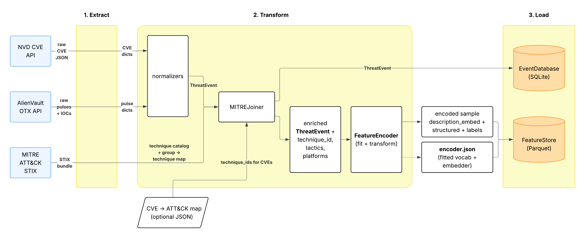

# Threatscope

**POC — A research-grade pipeline demonstrating data engineering and cybersecurity concepts, not production software.**
- Currently, the produced models are not trained on sufficient data to produce meaningful predictions. The architecture and pipeline are the artifact, not the weights.**
- This project currently doesn't consider distributability or dependency versions apart from the development environment.

**Threat Actor Behavior Prediction** – Ingest public cybersecurity threat intelligence, organize it into structured feature sets, and train a model to classify and predict threat actor tactics (e.g., mapping attacker behavior to MITRE ATT&CK techniques).

**Goal** – Assist security analysts in triaging incidents faster by auto-labeling observed behaviors.

---
# Design

### Dataflow



</br>

### MLflow

---

### Setup
**1. Download and enter the project directory**
```
git clone https://github.com/ZandtLavish/threatscope
cd threatscope/
```
</br>

**2. Tailor `config.yaml` to setup API Keys, hyperparameters, etc.**
</br>

---

### Command Flow

**1. ETL**
```bash
python -m src.main pipeline
```
</br>

**2. Create and test your model**
```bash
python -m src.main train
python -m src.main evaluate
```
</br>

**3. Predict a tactic**
```bash
python -m src.main predict --description <CVE/Incident description>
```